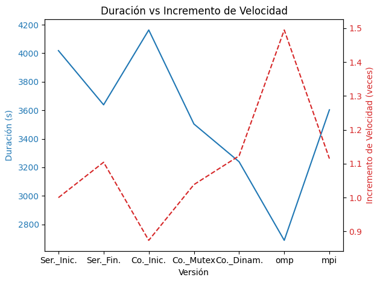
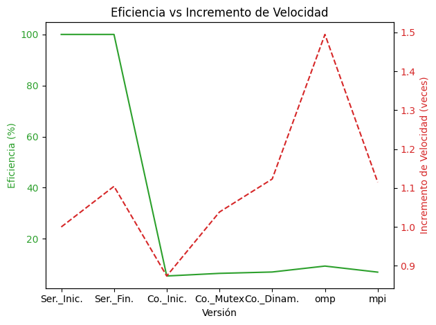

= Reporte de optimizaciones
:experimental:
:nofooter:
:source-highlighter: pygments
:sectnums:
:stem: latexmath
:toc:
:xrefstyle: short

[[serial_optimizations]]
== Optimizaciones seriales

[%autowidth.stretch,options="header"]
|===
|Iter. |Etiqueta |Duración (s) |_Speedup_ |Descripción corta
|0 |Serial0 |4018.292573346 |1.00 |Versión serial inicial (Tarea01)
|1 |Serial1 |3638.373046516 |1.10 |Función de configuración
|===

[[serial_iter00]]
=== Versión serial original (Tarea01)

image::Kcachegrind_Serial0.png[]

Con base en la información de KCachegrind, se identificó que la función simulate es la que más tiene impacto en el rendimiento, en aspectos como la copia de datos y el cálculo de temperaturas. Algunas posibles optimizaciones podrían ser la eliminación de copias redundantes de matrices y la optimización de la asignación dinámica de memoria. La optimización que se busca realizar debe mejorar el manejo de datos y agilizar el proceso de simulación.

=== Aspectos no eficientes

* La copia de datos entre matrices en cada iteración. Este proceso es costoso, ya que se realiza un recorrido completo por la matriz, generando sobrecarga, especialmente cuando se trabaja con matrices grandes.

* El bucle anidado en la actualización de celdas. Al igual que el aspecto anterior, a medida que el tamaño de la matriz aumenta, el costo de recorrer todas las celdas se hace cada vez mayor.

* La condición de parada basada en max_delta. En cada iteración, el código verifica si la diferencia máxima entre las temperaturas actualizadas y las anteriores permite detener la simulación. Calcular esta diferencia implica comparar cada nueva temperatura con la anterior, lo que añade una operación adicional en cada celda.

=== Aspectos que se consideraron eficientes

* El uso de memoria dinámica para las matrices. El uso de malloc para asignar memoria para las matrices permite trabajar con láminas de tamaño arbitrario o desconocido.

* El uso de variables locales. Estas permiten accesar a ellas rápidamente, sin introducir dependencias innecesarias entre las iteraciones.

[[serial_iter01]]
=== Iteración 1

Se implementó la función configure_simulation, de forma que solamente se realiza un llamado a esta para gestionar la lectura de archivos, la simulación y la escritura de los archivos de salida. De esta forma, los distintos procesos no se realizan desde la función main, sino que se agiliza el manejo de datos a través de una sola función. La optimización sí logró mejorar el tiempo de ejecución.

=== Código sin la optimización (dentro de la función main)

  if (read_dimensions(filepath, &plate) != EXIT_SUCCESS) {
    fclose(file);
    return EXIT_FAILURE;
  }
  if (read_plate(filepath, &plate) != EXIT_SUCCESS) {
    fclose(file);
    return EXIT_FAILURE;
  }
  int k;
  time_t time_seconds;
  simulate(&plate, delta_t, alpha, h, epsilon, &k, &time_seconds);
  create_report(job_file, plate_filename, delta_t, alpha, h, epsilon, k,
    time_seconds);
  char output_filename[MAX_PATH_LENGTH];
  snprintf(output_filename, sizeof(output_filename), "plate%03d-%d.bin",
    atoi(&plate_filename[5]), k);
  write_plate(output_filename, &plate);

=== Código optimizado (dentro de la función main)

  for (uint64_t i = 0; i < struct_count; i++) {
    plate_filename = simulation_parameters[i].bin_name;
    configure_simulation(plate_filename, simulation_parameters[i], report_path,
      input_dir, output_dir);
  }

=== Lecciones aprendidas

En este caso, aspectos como la copia de datos y el cálculo de temperaturas fueron los más costosos. Las áreas clave de ineficiencia incluyeron el proceso de copia de matrices en cada iteración, y los bucles anidados en la actualización de celdas, cuyo costo aumenta con el tamaño de la matriz. Además, la condición de parada basada en el max_delta, aunque necesaria, añade una carga extra al requerir comparaciones constantes. Por otro lado, aspectos eficientes incluyeron el uso de memoria dinámica para manejar matrices de tamaño arbitrario y el uso de variables locales para minimizar dependencias y acelerar el acceso a los datos en las iteraciones. En las iteraciones, se realizaron mejoras significativas a través de la reorganización del código para gestionar los diferntes procesos dentro de una sola función, y la agilización del manejo de datos. Esta simplificación evitó realizar procesos innecesarios desde la función main, mejorando tanto la claridad como el rendimiento. Como reflexión importante, podemos detacar la importancia de identificar los puntos de mayor carga computacional y de utilizar estructuras eficientes para minimizar el tiempo de ejecución en simulaciones complejas.

[[concurrent_optimizations]]
== Optimizaciones concurrentes

[%autowidth.stretch,options="header"]
|===
|Iter. |Etiqueta |Duración (s) |_Speedup_ |Eficiencia |Descripción corta
|- |Serial1 |3638.373046516 |1.00 |1.00 |Versión serial final
|1 |Conc1 (-) |4162.956732401 |0.87 |0.05 |Versión concurrente inicial (Tarea02)
|2 |Conc2 |3503.823419546 |1.03 |0.06 |Sincronización entre hilos
|3 |Conc3 |3239.175277653 |1.12 |0.07 |Mapeo dinámico
|===

[[conc_iter00]]
=== Versión concurrente inicial (Tarea02)

=== Aspectos no eficientes

* La asignación de memoria en cada hilo. Esto significa que, si se usan muchos hilos, se deben crear múltiples copias de la matriz, aumentando el uso de memoria y el tiempo dedicado a la asignación y liberación de esta, en especial si se trata de matrices muy grandes.

* La sincronización entre los hilos. Esta versión no cuenta con un mecanismo de sincronización entre los hilos. Aunque cada hilo trabaja en una parte separada de la matriz, pueden ocurrir problemas o conflictos entre los hilos a la hora de la lectura y escritura entre cada región.

* La distribución de las filas entre los hilos es estática. Esto puede ser un riesgo, ya que, si algunas filas tienen más celdas a actualizar debido a su proximidad con otras regiones, los hilos podrían estar desbalanceados en su carga.

=== Aspectos que se consideraron eficientes

* La modularización del código. Se utilizaron las funciones configure_simulation, simulate y thread_sim, para facilitar la separación entre las tareas de configuración, simulación principal y el trabajo que realiza cada hilo, permitiendo realizar cambios o mejoras de manera localizada sin afectar otras funciones del código.

* El manejo de los parámetros de la simulación. Estos se organizaron en una estructura de datos compartida, lo que simplifica el acceso a ellos por parte de los hilos. De esta forma, se reduce la necesidad de realizar pasos adicionales para pasar los argumentos a las funciones.

[[conc_iter01]]
=== Iteración 1

La optimización se centra en el uso de un mutex para sincronizar el acceso a la matriz compartida durante la simulación. Esto permitie evitar condiciones de carrera, donde dos o más hilos intenten leer o escribir en las mismas celdas simultáneamente. De esta forma, el programa es capaz de sincronizar los hilos para realizar trabajo paralelo sobre la matriz sin interferir entre ellos, evitando errores que puedan surgir en las simulaciones más complejas. La optimización sí logró mejorar el tiempo de ejecución.

=== Código sin la optimización (dentro de la función configure_simulation)

  uint64_t num_states;
  num_states = simulate(shared_data, thread_count);
  sim_states[i] = num_states;

=== Código optimizado (dentro de la función configure_simulation)

  pthread_mutex_init(&shared_data->matrix_mutex, NULL);
  uint64_t states = 0;
  simulate(&states, thread_count, shared_data);
  pthread_mutex_destroy(&shared_data->matrix_mutex);

[[conc_iter02]]
=== Iteración 2

El uso de mapeo dinámico en lugar de mapeo estático permite una mejor distribución de la carga de trabajo entre los hilos. Al tener una distribución más equilibrada de la carga, los hilos que terminan su trabajo pueden continuar trabajando en nuevas filas mientras otros siguen procesando su parte. Esto mejora el rendimiento general, ya que se logra un uso más eficiente de los hilos a lo largo de toda la simulación. La optimización sí logró mejorar el tiempo de ejecución.

Esta versión de mapeo es la que consiguió el mayor aumento en el desempeño.

=== Código sin la optimización (dentro de la función simulate)

  uint64_t rows_per_thread = (shared_data->rows - 2) / thread_count;
  thread_data[i].start_row = 1 + i * rows_per_thread;
  if (i == thread_count - 1) {
    thread_data[i].end_row = shared_data->rows - 1;
  } else {
    thread_data[i].end_row = thread_data[i].start_row + rows_per_thread;
  }
  thread_data[i].shared_data = shared_data;

=== Código optimizado (dentro de la función simulate)

  uint64_t rows_per_thread = (shared_data->rows - 2) / thread_count;
  thread_data[i].start_row = 1 + i * rows_per_thread;
  thread_data[i].end_row = (i == thread_count - 1) ?
    shared_data->rows - 1 : thread_data[i].start_row + rows_per_thread;
  thread_data[i].shared_data = shared_data;

=== Lecciones aprendidas

En la versión paralelizada inicial, se identificaron limitaciones significativas, como el uso ineficiente de memoria debido a la creación de múltiples copias de matrices en cada hilo, y la falta de sincronización entre hilos, lo que podía generar conflictos en el acceso a los datos compartidos. Además, la distribución estática de las filas resultó en un desbalance de carga, afectando el rendimiento. A medida que se realizaron iteraciones, se integraron mejoras cruciales, como la incorporación de un mutex para prevenir problemas de sincronización y permitir ejecutar los hilos de manera paralela sin conflictos en la escritura o lectura de la matriz compartida. Este cambio redujo errores en simulaciones complejas y mejoró el tiempo de ejecución. Posteriormente, en la segunda iteración, el uso de mapeo dinámico equilibró la distribución de trabajo entre los hilos, aprovechando mejor los recursos disponibles y logrando un incremento en el rendimiento. Este tipo de optimizaciones pueden significar una mejora importante en programas de esta naturaleza, y puede ser valioso tomarlas en cuenta a la hora de realizarlos.

[[omp]]
=== OpenMP

La tecnología de OpenMP permite paralelizar el programa con directivas fáciles de aplicar, sin necesidad de manejar directamente los hilos.Además, OpenMP incluye optimizaciones como el mapeo dinámico, que distribuye automáticamente la carga de trabajo entre los hilos de manera más equilibrada, asegurando que todos trabajen de forma eficiente. En cambio, la versión con Pthreads requiere programar manualmente la creación, sincronización y distribución de las tareas, lo que da lugar a implementaciones subóptimas que generen _overhead_ innecesario, haciendo que sea más complicado conseguir resultados eficientes en muchos casos. La versión con OpenMP fue más sencilla de entender, por lo que se pudo implementar una versión más intuitiva y sencilla. Los resultados muestran que esta versión logró mejorar el tiempo de ejecución considerablemente gracias a sus optimizaciones y su forma más simple de trabajar, a comparación de las versiones de Pthreads.

[[mpi]]
=== MPI

La versión con MPI se centra en la paralelización distribuida entre varios procesos, lo que la hace ideal para sistemas con múltiples nodos o máquinas, como los clústeres que ofrece la ECCI. Sin embargo, la comunicación entre ellos puede generar un costo adicional debido al intercambio de datos, lo que afecta el rendimiento en ciertas tareas. Comparada con la versión inicial de Pthreads, la versión con MPI resulta ser más adecuada para programas que necesitan escalar en sistemas distribuidos, pero sigue siendo más compleja de implementar y ajustar que OpenMP. Mientras el uso de OpenMP simplifica la paralelización en sistemas de memoria compartida al manejar automáticamente la creación y sincronización de hilos, la versión con MPI resultó ser más complicada de implementar, lo que pudo dar lugar a una implementación que no aprovechase completamente los recursos del clúster. En términos de rendimiento, la versión con MPI obtuvo un tiempo de ejecución mejor que la versión inicial de Pthreads, pero más lento que la versión con OpenMP, mostrando que, aunque es una buena opción para entornos distribuidos, no fue la más eficiente en este caso específico.

[[optimization_comparison]]
== Comparación de optimizaciones

La primera versión serial del programa tardó aproximadamente 4018 segundos (1.11 horas). Para mejorar el tiempo de ejecución, se optimizó el manejo de datos de forma general, se agilizó el proceso de simulación y se implementaron funciones de lectura, escritura, configuración y simulación más simples, que no introdujeran sobrecarga innecesaria. La función de configuración fue la mejora más destacada de esta versión, permitiendo realizar todos los procesos y manejar los datos de la simulación desde esta, con solamente un llamado. La primera versión paralelizada del programa disminuyó el desempeño. Para optimizarla, se implementó una versión que utilizaba un mutex como mecanismo de sincronización, el cuál permitía que los hilos trabajaran de mejor manera sobre la matriz. Finalmente, se creó otra versión en la que se implementó un mapeo dinámico de memoria, mejorando la carga de trabajo entre los hilos. La versión del mapeo dinámico fue la que produjo el mayor incremento en el desempeño.

A lo largo de las versiones del programa, se observa una tendencia de mejora en la eficiencia. La primera versión paralelizada alcanzó una eficiencia del 5.46 %. Si bien esta primera versión presentó una reducción respecto a la versión serial, fue un punto de partida para optimizar el uso de la concurrencia. La siguiente versión mostró una mejora en la eficiencia, alcanzando el 6.49 %. Este incremento sugiere que la implementación de sincronización a través de mutexes ayudó a gestionar mejor los hilos y a reducir las condiciones de carrera, permitiendo una ejecución más eficiente. Finalmente, la versión final alcanzó una eficiencia del 7.02 %, lo que demuestra que la introducción del mapeo dinámico de memoria contribuyó a mejorar el rendimiento. La versión del mapeo dinámico fue la que produjo el mayor incremento en la eficiencia.

[[concurrency_comparison]]
== Comparación del grado de concurrencia

image::Incremento_de_Velocidad_y_Eficiencia_a_Diferentes_Niveles_de_Concurrencia.png[]

El gráfico de incremento de velocidad (línea continua) muestra un aumento progresivo desde la versión serial final (S) hasta la versión que utiliza D hilos, donde se alcanza el máximo speedup. Esto significa que, conforme se incrementa el número de hilos, el programa mejora su desempeño. Sin embargo, se nota que el incremento de velocidad comienza a estabilizarse alrededor de la configuración 4C. Aunque no hay una caída en el speedup al incrementar el número de hilos a D, tampoco hay una mejora significativa, lo que sugiere que agregar más hilos no siempre resulta en mayores beneficios en cuanto a velocidad. La eficiencia (línea punteada), por otro lado, cae al incrementar el número de hilos. A medida que se introducen más hilos, la eficiencia disminuye. Es notable que la eficiencia baja a niveles muy bajos para las configuraciones de 2C, 4C, y D, lo que indica que, a medida que el número de hilos excede la cantidad de trabajo disponible, el sistema incurre en más sobrecarga de sincronización y gestión de hilos, lo que disminuye la eficiencia. A partir de los resultados, la cantidad óptima de hilos para conseguir el mejor rendimiento es la configuración 2C (el doble del número de núcleos de la máquina). Esta configuración ofrece un balance adecuado entre el incremento de velocidad y la eficiencia, alcanzando un buen speedup sin sacrificar demasiado la eficiencia. Por tanto, agregar más hilos más allá de 2C no resulta en un beneficio considerable y solo aumenta el uso ineficiente de recursos.
